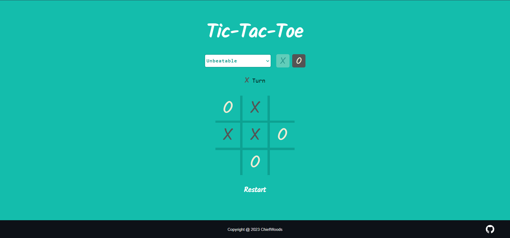

# Tic-Tac-Toe



Web game for [The Odin Project](https://www.theodinproject.com/).

[Live Website](https://chiefwoods.github.io/tic-tac-toe/)  

[Source Repository](https://github.com/ChiefWoods/tic-tac-toe)

## Features

- Play against a friend or a computer
- Play at an 'Unbeatable' difficulty
- Start as either 'X' or 'O'

## Built With

### Languages

- [](https://html5.org/)
- [](https://www.w3.org/Style/CSS/Overview.en.html)
- [](https://js.org/index.html)

### Tools

- [](https://code.visualstudio.com/)

## Getting Started

### Setup

1. Clone the repository
```
git clone https://github.com/ChiefWoods/tic-tac-toe.git
```

## Issues

View the [open issues](https://github.com/ChiefWoods/tic-tac-toe/issues) for a full list of proposed features and known bugs.

## Acknowledgements

### Resources

- [Shields.io](https://shields.io/)
- [Google Fonts](https://fonts.google.com/)
- [Pictogrammers](https://pictogrammers.com/)

### Hosting

- [GitHub Pages](https://pages.github.com/)

## Contact

[chii.yuen@hotmail.com](mailto:chii.yuen@hotmail.com)